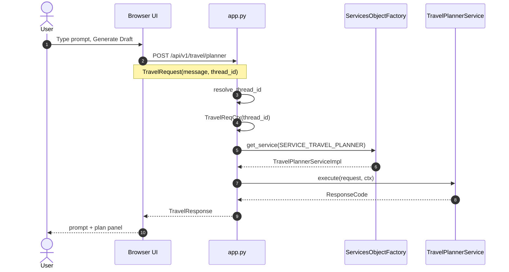
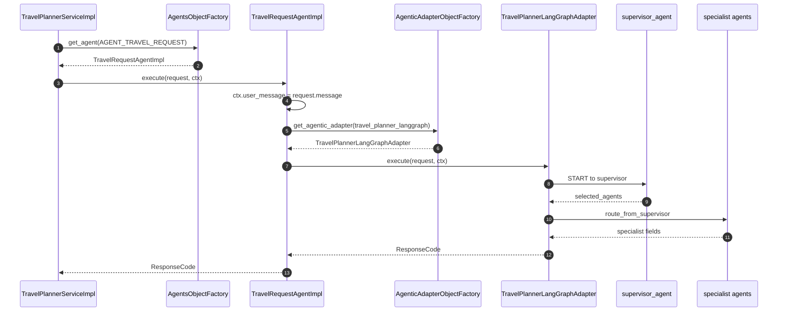

# Travel request path

The three sequences below are also in the root [README.md](../../README.md). This page is the place for more diagrams and layer notes as the graph grows.

A Generate Draft click is three hops: **browser to the planner service**, **service to graph agents**, **one agent to the LLM provider**. `TravelRequest` / `TravelReqCtx` stay on the travel side. LangGraph nodes wrap those in `LLMRequest` / `LLMReqCtx` only when they call a vendor.

Today `TravelRequestAgentImpl` copies `request.message` onto `ctx.user_message`. The adapter-factory hop in diagram 2 is the next `execute` target.

## 1. User to browser to `app.py` to the planner service

`app.py` talks only to the `TravelPlannerService` interface. Approve is the same `execute` via `POST /api/v1/travel/approve`.

## 2. Planner service to adapter factory to agents

`TravelPlannerLangGraphAdapter` is one `AgenticFrameworkAdapter`. A later ADK or Strands adapter would register on the same factory.

## 3. `supervisor_agent` to the LLM provider

Unset `LLMRequest.provider` defaults to Groq. `get_provider` uses `request.config` (model and the rest) from the caller.

## Layers

| Layer | Module | Role |
| --- | --- | --- |
| UI | `portals/your-next-travel-app` | Angular portal: auth, dashboard, planner, preferences |
| App | `app.py` | API only: auth, preferences, planner, approve, catalog |
| Service | `core/services/interfaces.py`, `impl/planner_impl.py` | `TravelPlannerService.execute` |
| Core agent | `core/agents/impl/travel_req_agent.py` | Normalize the user message; hand off to an adapter |
| Agentic adapter | `adapters/agentic/objects.py`, `langgraph/travel_planner.py` | Factory → compiled graph |
| Graph agents | `adapters/agentic/langgraph/agents/` | Supervisor, specialists, HITL, final |
| LLM adapter | `adapters/llm_providers/` | `LLMProvider.complete` (Groq default) |
