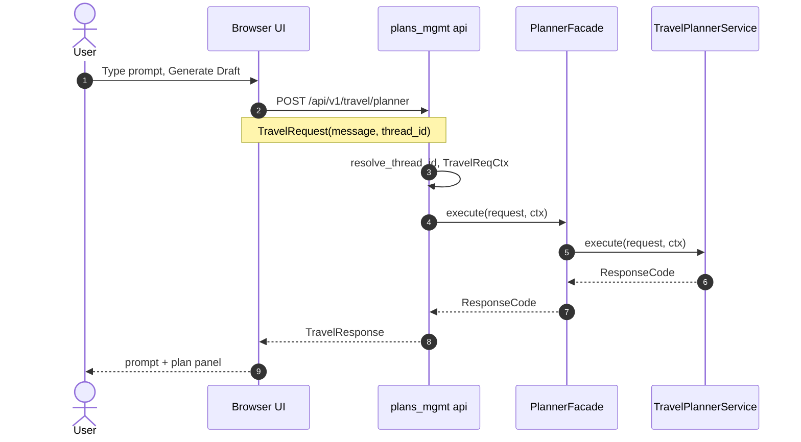
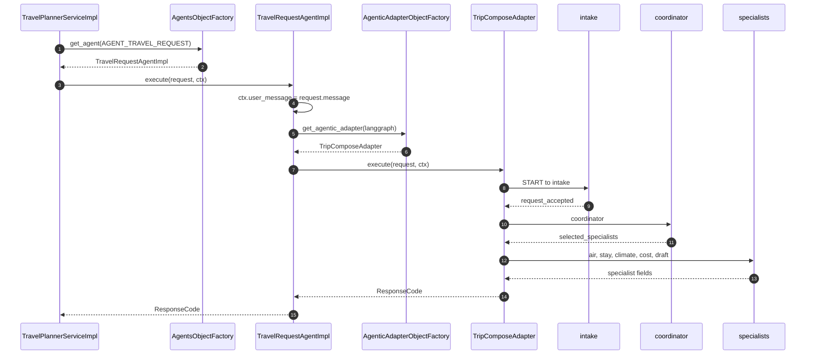
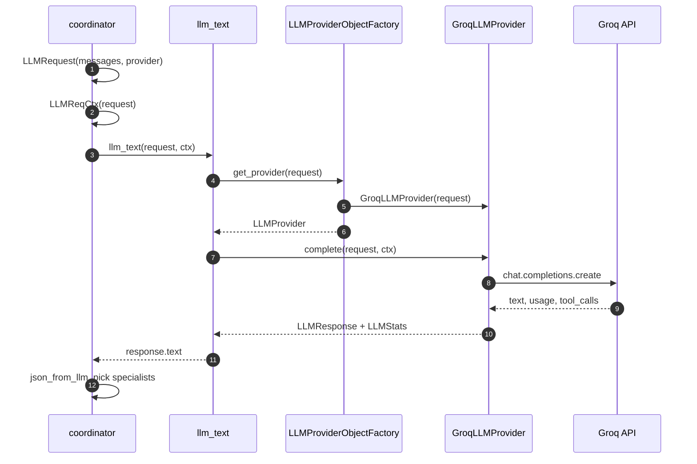

# Travel request path

The sequences below are also in the root [README.md](../../README.md). This page is the place for more diagrams as the trip compose graph grows.

A Generate Draft click is three hops: **browser to the planner service**, **service to the compose graph**, **one specialist to the LLM provider**. `TravelRequest` / `TravelReqCtx` stay on the travel side. Graph nodes wrap those in `LLMRequest` / `LLMReqCtx` only when they call a model.

Today `TravelRequestAgentImpl` copies `request.message` onto `ctx.user_message`. The adapter factory in diagram 2 is the `execute` target.

## 1. User to browser to the API to the planner service

The router in `middleware/modules/plans_mgmt/api/router.py` talks to `PlannerFacade`, which talks only to the `TravelPlannerService` interface. Approve is the same `execute` via `POST /api/v1/travel/approve`.

## 2. Planner service to adapter factory to specialists

`TripComposeAdapter` is one `AgenticFrameworkAdapter` in `middleware/adapters/agentic/langgraph/`. A later ADK or Strands adapter would register on the same factory. `plans_mgmt` does not import LangGraph.

## 3. Coordinator to the LLM provider

Unset `LLMRequest.provider` defaults to the catalog default (Ollama locally). `get_provider` uses `request.config` from the caller.

## Layers

| Layer | Path | Role |
| --- | --- | --- |
| UI | `portals/your-next-travel-app` | Angular portal: auth, dashboard, planner, preferences |
| API entry | `middleware/app.py`, `middleware/api/factory.py` | Uvicorn target; mounts module routers |
| Feature API | `middleware/modules/plans_mgmt/api/router.py` | Planner, approve, journal happenings |
| Facade | `middleware/modules/plans_mgmt/facades/planner_facade.py` | Thin handoff to the service |
| Service | `middleware/modules/plans_mgmt/services/planner_service.py` | Persist the trip; call the travel agent |
| Shared factories | `middleware/modules/shared/` | `ServicesObjectFactory`, `DaoObjectFactory` |
| DAO | `middleware/modules/plans_mgmt/persistence/` | Travel request table and DAO |
| Platform DB | `middleware/persistence/` | Alembic, engine, `Base`, checkpointer |
| Core agent | `middleware/core/agents/impl/travel_req_agent.py` | Normalize the user message; hand off to an adapter |
| Agentic adapter | `middleware/adapters/agentic/objects.py`, `langgraph/trip_compose.py` | Factory → compiled trip compose graph |
| Specialists | `middleware/adapters/agentic/langgraph/specialists/` | Intake, coordinator, research, traveler review, assemble |
| LLM adapter | `middleware/adapters/llm_providers/` | `LLMProvider.complete` (Ollama, Groq) |
| Local data | `runtime-data/local-deploy/` | SQLite and preference packs (not in git) |

Call sequence: API → facade → service → DAO and/or adapter factory → LangGraph (or later ADK) → LLM provider.
