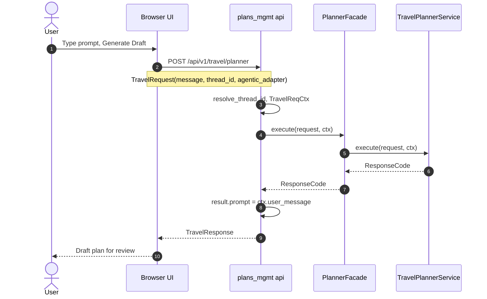
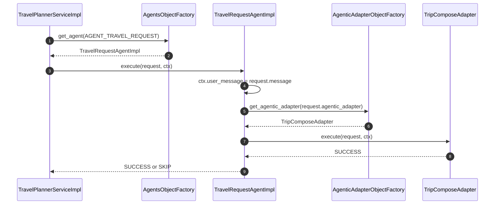

# Your Next Travel

<p align="center">
  
</p>

<p align="center">
  
  
  
  
  
  
  
  
  
  
  
</p>

**A travel portal you run yourself.** Watch the cities you care about, read what is on nearby, and draft a trip you can sit with — then approve it, change it, or delete it. The project authors do not host your account.

**Your Travel Portal (YTP)** is the project. **Your Next Travel** is the name you see in the browser. Your places, preference packs, drafts, and keys stay on your laptop or on a cloud you own.

> **You run it.** There is no hosted Your Next Travel. Clone it, start it, and the portal is yours.

> **Your data stays with you.** Preference packs and the local database live under `runtime-data/local-deploy/` on the machine you chose. They are not in this git repository.

> **A planner, not a booking site.** You review every draft. Nothing is purchased or reserved for you. You keep the keys.

## Table of contents

- [The idea](#the-idea)
- [Who it is for](#who-it-is-for)
- [What you can do](#what-you-can-do)
  - [Watch the places that matter](#watch-the-places-that-matter)
  - [Say how you like to travel](#say-how-you-like-to-travel)
  - [See what is on nearby](#see-what-is-on-nearby)
  - [Draft a trip and review it](#draft-a-trip-and-review-it)
  - [Keep the privacy you care about](#keep-the-privacy-you-care-about)
- [How to use it](#how-to-use-it)
- [How it's built (short)](#how-its-built-short)
- [Local development](#local-development)
- [Request flow](#request-flow)
  - [1. User to the API to the planner service](#1-user-to-the-api-to-the-planner-service)
  - [2. Planner service to TravelRequestAgentImpl](#2-planner-service-to-travelrequestagentimpl)
- [Where code lives](#where-code-lives)
- [Understanding Python Frameworks](#understanding-python-frameworks)
  - [Uvicorn Usage](#uvicorn-usage)
    - [How Uvicorn integrates with FastAPI](#how-uvicorn-integrates-with-fastapi)
    - [How Uvicorn finds the app object](#how-uvicorn-finds-the-app-object)
    - [What ASGI stands for and why it matters](#what-asgi-stands-for-and-why-it-matters)
    - [What came before ASGI](#what-came-before-asgi)
    - [ASGI servers and alternatives](#asgi-servers-and-alternatives)
    - [Compared to Tomcat and WebLogic](#compared-to-tomcat-and-weblogic)

## The idea

<p align="center">
  
</p>

Most travel sites keep your searches, your saved places, and the models that write the plan. Your Next Travel is the opposite: a planning desk that lives with you.

- **Places you watch** — up to five cities and how far you will travel from each
- **Briefs that plan** — what kind of month it is, what is on nearby, and a trip draft you can sit with
- **Privacy you keep** — your account, drafts, and keys never go to a hosted Your Next Travel service, because there is not one

You open the portal, tell it where you look, and it helps you see the next trip. You approve the draft, ask for a change, or delete the plan. Nothing leaves the machine you chose unless you send it.

## Who it is for

Travelers who want a private planning space. Families who keep a short list of cities they return to. Anyone who would rather review a draft at the kitchen table than hand a trip to a site they do not run.

If you can start the app on your computer (or on a small cloud box you own), you can use it. You do not need an account with the project authors.

## What you can do

### Watch the places that matter

On **Account → Places**, add up to five cities and a radius. Those are the places the portal watches. Briefs and drafts stay grounded in that list instead of inventing a destination you never asked for.

### Say how you like to travel

Preference packs describe who you are on the road: a beach week, a budget trip, a city break, traveling with family, going solo. You pick a few. The briefs and the trip draft read those packs so the tone matches how you actually travel.

### See what is on nearby

The journal and places views look at the cities you watch:

- **What kind of month?** — a short read on the season and the mood of the places you listed
- **What’s on nearby?** — happenings in your radius for the week, month, or quarter
- **Think the trip through** — a deeper pass when you want more than a skim

You stay in the cities you already care about. The portal does not send you a catalog of the whole world.

### Draft a trip and review it

When you are ready, you write what you want — a long weekend, a rail trip, a quiet week by water — and ask for a draft.

The portal gathers air, stays, climate, and cost notes, then writes an itinerary you can read. You can:

1. **Approve** the draft and keep it
2. **Send feedback** and ask it to try again
3. **Delete** a plan when you are done (it asks you to type a confirmation phrase)

You stay in the loop. The draft is a starting point, not a booking you cannot undo.

### Keep the privacy you care about

On **Account** you can see when you last signed in, choose how briefs are written, and delete your account. Preference files and the local database live under `runtime-data/local-deploy/` on the machine you run. They are not in this git repository and not on a shared Your Next Travel host.

Run it at home, or on AWS, Azure, GCP, or another cloud **you** own. You keep the keys.

## How to use it

1. Start the portal on your machine (`npm run local:app-run` — details below).
2. Open **http://127.0.0.1:4200** and create your account.
3. Add the cities you watch and a radius. Save places.
4. Pick preference packs that sound like you.
5. Open the journal or places view and read what is nearby.
6. Ask for a trip draft. Read it. Approve it, comment, or delete it.
7. When you want a clean slate, delete the plan or the account from Account → Privacy.

That is the whole traveler loop. The rest of this README is for people who run or change the software.

## How it's built (short)

Enough to know what you are running, not a stack tour:

| You see | What is underneath |
| --- | --- |
| The portal in the browser | Angular |
| Sign-in, places, drafts, journal | FastAPI under `middleware/` |
| The trip draft you review | LangGraph specialists (air, stays, climate, cost) |
| Briefs and nearby happenings | The same models you picked on Account |
| Your data | SQLite by default, or Postgres if you set a URL |
| The writing | Ollama on this machine, or Groq if you bring your own key |

A later Google ADK adapter can sit beside LangGraph. The portal and your account do not change.

## Local development

Local only. One command is enough:

```bash
npm run local:app-run
```

That command:

1. Activates this repo's `.venv` if your shell is not already using it
2. Runs `uv sync`
3. Starts FastAPI, which runs Alembic (Liquibase-style) `upgrade head` on every boot
4. Starts the Angular portal after `/health` is ready

- API: `http://127.0.0.1:8000`
- Portal: `http://127.0.0.1:4200`
- Schema-only: `npm run local:schema-setup`
- Local data: `runtime-data/local-deploy/` (SQLite and preference packs; created on this machine, not in git)

Optional: `OLLAMA_BASE_URL` (default `http://127.0.0.1:11434`) for a local Ollama provider.

## Request flow

What runs **today**. The UI sends `agentic_adapter` (default `langgraph`). The API lives under `middleware/`. Each feature module owns its api, facade, service, and DAOs. LangGraph and LLM providers stay in `middleware/adapters/` so the same module can later use Google ADK. More diagrams are in [Docs/Design/TravelReqAgentImpl.md](Docs/Design/TravelReqAgentImpl.md).

### 1. User to the API to the planner service



### 2. Planner service to TravelRequestAgentImpl



More diagrams (coordinator, LLM provider): [Docs/Design/TravelReqAgentImpl.md](Docs/Design/TravelReqAgentImpl.md).

## Where code lives

| Layer | Path | Role |
| --- | --- | --- |
| UI | `portals/your-next-travel-app` | Angular portal |
| API entry | `middleware/app.py`, `middleware/api/factory.py` | Uvicorn target; mounts module routers |
| Feature module | `middleware/modules/<feature>/` | `api/`, facades, services, `persistence/` (entities + DAOs) |
| Shared factories | `middleware/modules/shared/` | `ServicesObjectFactory`, `DaoObjectFactory` |
| Platform DB | `middleware/persistence/` | Alembic, engine, `Base`, checkpointer |
| Agentic adapters | `middleware/adapters/agentic/` | `TripComposeAdapter` (LangGraph); ADK would register here |
| LLM providers | `middleware/adapters/llm_providers/` | Ollama, Groq |
| Local data | `runtime-data/local-deploy/` | SQLite and preference packs (not in git) |

Call sequence: API → facade → service → DAO and/or adapter factory → LangGraph (or later ADK) → LLM provider.

## Understanding Python Frameworks

FastAPI is the **application** (routes, validation, responses). Uvicorn is the **server** that listens on a host and port and calls that application. They meet through **ASGI**, a standard interface in Python web stacks.

### Uvicorn Usage

Your Next Travel starts the API from `middleware/app.py` with configurable host and port (defaults: `0.0.0.0` and `8000`):

```bash
python -m middleware.app
python -m middleware.app --host 0.0.0.0 --port 9000
```

Or set `HOST` / `PORT` in the environment or a `.env` file. CLI flags override env. The equivalent Uvicorn CLI is:

```bash
uvicorn middleware.app:app --host 0.0.0.0 --port 8000 --reload
```

#### How Uvicorn integrates with FastAPI

Uvicorn and FastAPI are two layers.

- **FastAPI is an ASGI app.** `app = FastAPI(...)` builds an object that implements `async def __call__(scope, receive, send)`. `@app.get` / `@app.post` only register routes on that object. FastAPI does **not** open a socket or listen on a port.
- **Uvicorn is the ASGI server.** `uvicorn.run(...)` binds `host` / `port`, speaks HTTP, and for each request:
  1. Parses the HTTP request into ASGI `scope` / `receive`
  2. Calls `await app(scope, receive, send)`
  3. FastAPI matches the path, runs your handler, builds a response
  4. Uvicorn writes that response back to the client

`if __name__ == "__main__"` means this only runs when you execute `python -m middleware.app`. Importing `app` (tests, or `uvicorn middleware.app:app` on the CLI) creates the FastAPI instance but does not start the server twice.

#### How Uvicorn finds the app object

Uvicorn does not scan the project for FastAPI classes. You point it at **one object** with an import path.

In `middleware/app.py` that argument is `"middleware.app:app"`:

| Part | Meaning in this repo |
| --- | --- |
| Left `middleware.app` | The **module** `middleware/app.py` |
| Right `app` | The **variable** `app = FastAPI(...)` in that module |

Uvicorn does the equivalent of:

```python
import importlib

module = importlib.import_module("middleware.app")  # loads middleware/app.py
asgi_app = getattr(module, "app")                   # the FastAPI() instance
```

Then it only talks to that object. Other classes (`TravelPlannerService`, templates, and so on) are used only because your route functions call them.

With `reload=True`, a parent process watches files. A **child** process imports `"middleware.app:app"` again after a change. That is why reload needs the string. Passing the in-memory `app` object works without reload, but the reloader cannot re-import it.

If you renamed the instance (for example `api = FastAPI(...)`), you would pass `"middleware.app:api"`. If that path is missing or the object is not ASGI-callable, Uvicorn fails — it will not guess another object. The left side stays `middleware.app` because that is the **module** name, not the variable name.

#### What ASGI stands for and why it matters

**ASGI** is **Asynchronous Server Gateway Interface**. It is the contract between a web server (Uvicorn, Hypercorn, Daphne) and a Python web app (FastAPI, Starlette, Django). The server does not need FastAPI internals; the app does not need to know sockets. They agree on one callable:

```python
async def app(scope, receive, send):
    ...
```

- `scope` — request metadata (path, method, headers, type `http` / `websocket` / `lifespan`)
- `receive` — await incoming body / events
- `send` — await outgoing response / events

Python’s older web apps were mostly **sync**: one request occupies one thread or process until it finishes. Modern APIs wait a lot (LLM calls, HTTP, DB, WebSockets). ASGI lets the server **await** those without blocking the whole worker, so one process can handle many concurrent connections. It also standardizes HTTP, WebSockets, and startup/shutdown in one interface.

#### What came before ASGI

**WSGI** (Web Server Gateway Interface, PEP 333 / 3333, ~2003) is the synchronous predecessor:

```python
def app(environ, start_response):
    start_response("200 OK", [("Content-Type", "text/plain")])
    return [b"hello"]
```

Used by Flask, classic Django, and Pyramid. Served by Gunicorn, uWSGI, Waitress, and mod_wsgi.

WSGI is request/response only, **synchronous**, and has no first-class WebSockets or long-lived streams. You can run WSGI apps on ASGI via adapters (`a2wsgi`, `WSGIMiddleware`), but they stay sync underneath.

| | WSGI | ASGI |
| --- | --- | --- |
| Style | sync | async (can still call sync code) |
| Connections | one request, then done | many concurrent, plus WebSockets |
| Typical apps | Flask, classic Django | FastAPI, Starlette, Django (ASGI mode) |
| Typical servers | Gunicorn, uWSGI | Uvicorn, Hypercorn, Daphne |

#### ASGI servers and alternatives

These are ASGI **servers** (alternatives to Uvicorn):

- **Uvicorn** — asyncio; common FastAPI default (what Your Next Travel uses)
- **Hypercorn** — HTTP/1, HTTP/2, HTTP/3; asyncio / Trio / uvloop
- **Daphne** — Django Channels; strong on WebSockets
- **Granian** — Rust-based ASGI/WSGI/RSGI server
- **Gunicorn + Uvicorn workers** — Gunicorn supervises processes; each worker is Uvicorn (common in production)

Related but not ASGI:

- **WSGI** — still fine for sync Flask/Django
- **RSGI** — another Python async app interface (Granian); less common

Because FastAPI speaks ASGI, `"middleware.app:app"` can be served by any ASGI server, not only Uvicorn.

#### Compared to Tomcat and WebLogic

Yes — **same job at a high level**: they accept HTTP (and often WebSockets), then hand the request to your application.

| Java world | Python ASGI world |
| --- | --- |
| Tomcat, Jetty | Uvicorn, Hypercorn, Daphne |
| WebLogic, WebSphere (full app server) | closer to Gunicorn + Uvicorn, or nginx + Uvicorn |
| WAR / servlet (`HttpServlet`) | ASGI app (`FastAPI()` / Django) |
| `web.xml` / servlet mapping | `@app.get`, `@app.post` |

Tomcat and WebLogic are **heavy application servers**: many Java apps, thread pools, JNDI, datasources, sessions, clustering, admin consoles.

Uvicorn, Hypercorn, and Daphne are **slim protocol servers**. They mostly bind a port, speak HTTP/ASGI, and call one Python app. They do not ship a Java-style admin console or JNDI. TLS, process management, and load balancing are usually **nginx/Caddy + Gunicorn/systemd/Docker**.

- **Uvicorn** ≈ a small Tomcat for one FastAPI process
- **WebLogic** ≈ a whole platform (server + ops + extras)
- **Gunicorn with Uvicorn workers** ≈ a production farm: one master, several workers

In Your Next Travel, Uvicorn is the server; FastAPI is the app inside it — like Tomcat hosting one webapp.
